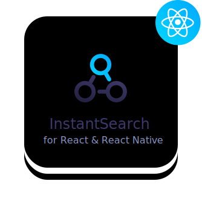

<p align="center">
  <a href="https://community.algolia.com/react-instantsearch">
    
  </a>

  <p align="center">
    React InstantSearch is a library for building blazing fast search-as-you-type search UIs with <a href="https://www.algolia.com">Algolia</a>.
  </p>
</p>

---

[![Version][version-svg]][package-url] [![Build Status][travis-svg]][travis-url] [![License][license-image]][license-url] [![Downloads][downloads-image]][downloads-url]

React InstantSearch is a React library that lets you create an instant-search result experience using [Algolia][algolia-website]’s search API. It is part of the InstantSearch family:

**React InstantSearch** | [InstantSearch.js][instantsearch.js-github]  | [Angular InstantSearch][instantsearch-angular-github] | [Vue InstantSearch][instantsearch-vue-github] | [InstantSearch Android][instantsearch-android-github] | [InstantSearch iOS][instantsearch-ios-github].

## Documentation

The documentation is available at [community.algolia.com/react-instantsearch][website].

## Installation

React InstantSearch is available on the npm registry.

```sh
yarn add react-instantsearch
# or
npm install react-instantsearch
```

## Contributing

We welcome all contributors, from casual to regular. You are only
one command away to start the developer environment, [read our CONTRIBUTING guide](CONTRIBUTING.md).

## License

React InstantSearch is [MIT licensed](LICENSE).

<!-- Links -->

[website]: https://community.algolia.com/react-instantsearch
[algolia-website]: https://www.algolia.com/
[instantsearch.js-github]: https://github.com/algolia/instantsearch.js
[instantsearch-android-github]: https://github.com/algolia/instantsearch-android
[instantsearch-ios-github]: https://github.com/algolia/instantsearch-ios
[instantsearch-vue-github]: https://github.com/algolia/vue-instantsearch
[instantsearch-angular-github]: https://github.com/algolia/angular-instantsearch
[travis-svg]: https://img.shields.io/travis/algolia/react-instantsearch/master.svg?style=flat-square
[travis-url]: https://travis-ci.org/algolia/react-instantsearch
[license-image]: http://img.shields.io/badge/license-MIT-green.svg?style=flat-square
[license-url]: LICENSE
[downloads-image]: https://img.shields.io/npm/dm/react-instantsearch.svg?style=flat-square
[downloads-url]: http://npm-stat.com/charts.html?package=react-instantsearch
[version-svg]: https://img.shields.io/npm/v/react-instantsearch.svg?style=flat-square
[package-url]: https://yarnpkg.com/en/package/react-instantsearch
